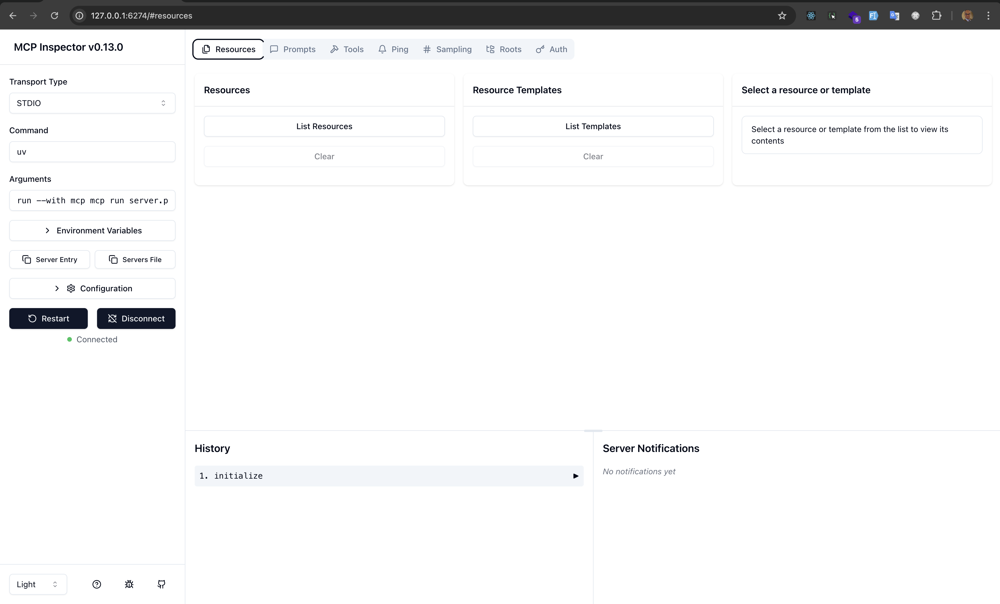

# MCP - Server Guide

Follow these step-by-step instructions to set up and run your MCP server:

---

## Screenshot

Below is a screenshot of the MCP server in action:



---

## 1. Initialize the Project

Initialize your project using `uv`:

```sh
uv init
```

## 2. Create a Virtual Environment

Create a new virtual environment with:

```sh
uv venv
```

You will see output similar to:

```
Using CPython 3.12.6 interpreter at: /Library/Frameworks/Python.framework/Versions/3.12/bin/python3.12
Creating virtual environment at: .venv
Activate with: source .venv/bin/activate
```

## 3. Activate the Virtual Environment

Activate the environment:

```sh
source .venv/bin/activate
```

## 4. Install MCP and Dependencies

Install the MCP package and its CLI dependencies:

```sh
uv pip install "mcp[cli]"
```

This will install all required packages.

## 5. Run the MCP Server

Start your MCP server using the CLI:

```sh
mcp dev server.py
```

- The first time, you may be prompted to install additional packages (e.g., `@modelcontextprotocol/inspector`).
- Confirm by typing `y` if prompted.

You should see output similar to:

```
Starting MCP inspector...
⚙️ Proxy server listening on port 6277
🔍 MCP Inspector is up and running at http://127.0.0.1:6274 🚀
```

---

Your MCP server is now running and accessible for development and inspection!

For more details on how the server is implemented, see `Instruction.md`.
